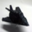
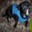

# CIFAR-10 Image Classification with Keras

This project demonstrates an end-to-end pipeline for classifying images from the CIFAR-10 dataset using a Convolutional Neural Network (CNN) built with Keras and TensorFlow. The workflow includes data loading and visualization, model creation, training, saving, and inference on sample images.

## CIFAR-10 Dataset

The CIFAR-10 dataset consists of 60,000 32x32 color images in 10 classes. Each image is represented as a 32x32x3 array. While the dataset contains more than 1,000 images per class, below are a few representative samples for each class.

### Sample Images







## Project Overview

- **Dataset:** CIFAR-10 – 60,000 32x32 color images in 10 classes.
- **Objective:** Build and train a CNN to classify images into one of 10 classes.
- **Key Steps:**
  - Load and preprocess the CIFAR-10 dataset.
  - Visualize sample images from the dataset.
  - Construct a CNN model with convolutional, dropout, pooling, and dense layers.
  - Train the model and evaluate its performance.
  - Save sample images from each class.
  - Use the trained model for inference on new images.

## Project Structure

Install the dependencies using pip:

```bash
pip install tensorflow numpy matplotlib pillow

git clone <repository-url>
cd <repository-directory>
```

### Model Architecture

The CNN model is defined as follows:

- **Convolutional Layers:**  
  - Two 2D convolution layers with 32 filters each, a kernel size of (3, 3), ReLU activation, and max-norm constraints to regularize the network.

- **Dropout Layers:**  
  - Dropout layers are applied after the convolutional layers and the dense layer to prevent overfitting.

- **Pooling Layer:**  
  - A max-pooling layer is used to reduce the spatial dimensions of the feature maps.

- **Flatten Layer:**  
  - A flatten layer converts the 2D feature maps into a 1D vector.

- **Dense Layers:**  
  - One dense layer with 512 neurons and ReLU activation.  
  - A final dense layer with 10 neurons and softmax activation for classification.

The model is compiled using the Stochastic Gradient Descent (SGD) optimizer with a learning rate of 0.01, momentum of 0.9, and a decay rate calculated based on the number of epochs.
